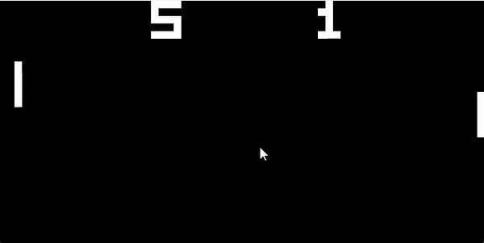
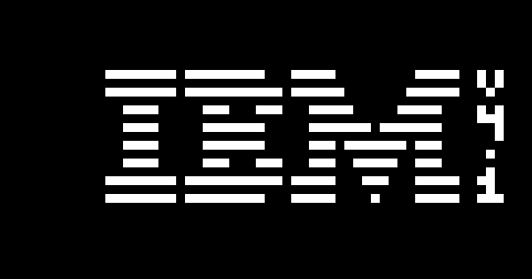

# CHIP8 Emulator
This project is a CHIP-8 emulator written in C++ using the SDL2 library for rendering and input handling. The CHIP-8 is an interpreted programming language, which was initially used on the COSMAC VIP and other early microcomputers. The emulator allows you to play classic CHIP-8 games by interpreting their bytecode and rendering graphics.

## Features
- Complete implementation of the CHIP-8 interpreter.
- Rendering using SDL2 for cross-platform compatibility.
-  input handling mapped to the original CHIP-8 keys.
- Support for loading and running CHIP-8 ROMs.
  
## Previews
### Pong

### IBM Logo

## Requirements
- C++17 or later
- SDL2 library

## To Be Implemented
- GUI Debugger: Display the values of memory and registers for easier debugging.
- Customizable Colors: Change the color for the background and foreground.
- Sound Implementation: Add support for sound effects.
- Save/Load State: The ability to save and load the emulator state.